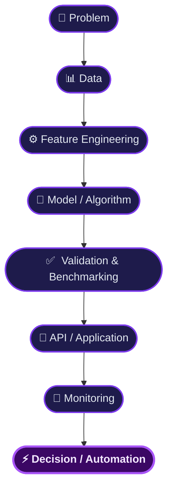
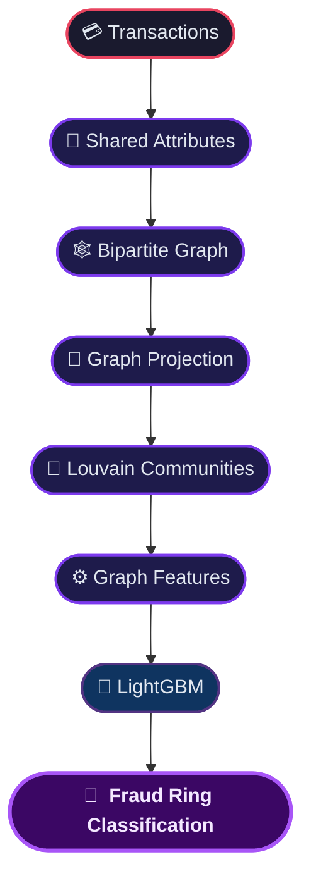
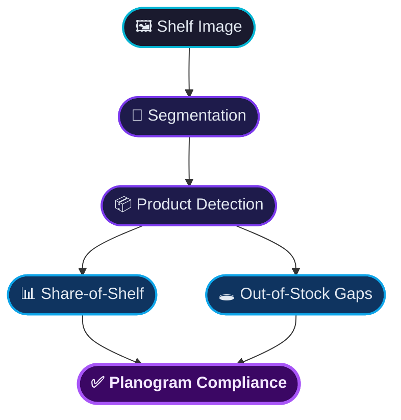

  

  

  
  

  <strong>Engineering intelligent systems that turn data, models and automation into production decisions.</strong>

---

  

  
  
  

  
  
  

  
  
  
  

---

<h2 align="center">⚡ Snapshot</h2>

<table width="100%">
<tr>
<td align="center" width="25%"><strong>58+</strong> Public Repositories</td>
<td align="center" width="25%"><strong>Python</strong> Primary Engineering Language</td>
<td align="center" width="25%"><strong>AI + ML</strong> Core Discipline</td>
<td align="center" width="25%"><strong>MLOps</strong> Production Focus</td>
</tr>
</table>

---

# 🧠 About

I'm a **Senior AI & Machine Learning Engineer** who designs and builds production-grade intelligent systems — end to end, from problem formulation and data engineering through modeling, evaluation, serving, monitoring, and operational decision-making.

I treat machine learning as systems engineering, not a collection of notebooks:

Areas I work in:

* 🤖 Agentic AI & LLM applications
* 🔎 Search & information retrieval
* 🧠 Recommendation systems
* 📈 Forecasting & time-series intelligence
* 💰 Pricing & revenue optimization
* 🏭 Inventory & operations optimization
* 🛡️ LLM security & guardrails
* 📊 Data quality & drift monitoring
* 🕸️ Graph machine learning
* ⚡ Real-time anomaly detection
* 🧾 Financial document intelligence
* 🏥 Clinical NLP & risk modeling
* 👁️ Classical computer vision
* 🔬 Synthetic data
* ⚙️ MLOps & production ML architecture

---

# 🏆 Featured Systems

<table width="100%">
<tr>
<td width="50%" valign="top">

### 🛰️ Atlas
<b>PLATFORM</b>

Central ML service registry and health platform — service discovery, full-text search, and async health probing across a fleet of ML microservices.

</td>
<td width="50%" valign="top">

### 🤝 Copilot-Desk
<b>AGENTIC AI</b>

Multi-agent analytics copilot — planner, SQL builder, and AST-level guardrails turn business questions into validated, grounded analysis over read-only DuckDB.

</td>
</tr>
<tr>
<td width="50%" valign="top">

### 🛡️ Guardrail-Hub
<b>AI SECURITY</b>

LLM security gateway — prompt-injection detection, base64 decode-and-rescan, and PII scrubbing ahead of every model call.

</td>
<td width="50%" valign="top">

### 📡 ETL-Watch
<b>DATA ENGINEERING</b>

Data quality and drift monitoring — column expectations, PSI/chi-square drift, and freshness and volume SLAs that gate bad batches before they reach a model.

</td>
</tr>
<tr>
<td width="50%" valign="top">

### 🧪 Prompt-Forge
<b>LLM ENGINEERING</b>

Prompt engineering and evaluation workbench — a versioned registry, assertion-based tests, and regression gates on cost and accuracy.

</td>
<td width="50%" valign="top">

### 📈 Time-Grid
<b>FORECASTING</b>

Hierarchical forecasting and what-if planning — Fourier and ridge models with bottom-up and top-down reconciliation across a full KPI tree.

</td>
</tr>
</table>

Prefer an interactive view? See the <a href="./projects-showcase.html">animated project showcase</a> (open in browser — GitHub can't render CSS animations inline).

---

# 🔬 Systems by Business Domain

Production systems built across industries — each solving a real, measurable business problem.

<table width="100%">
<tr>
<td width="50%" valign="top">

#### 🔎 Search & Discovery
*Helping people find what they're looking for — faster and more accurately.*

**Search-Smith** — E-commerce search that understands intent, not just keywords. Learns from real click behavior to surface the most relevant results. 
**Rec-Stack** — Personalized recommendations that start broad and rank by what each user is most likely to engage with.

</td>
<td width="50%" valign="top">

#### 🤖 AI Assistants & Agents
*Automating analytical and operational work through intelligent, multi-step reasoning.*

**Query-Smith** — Ask a business question in plain English; get a validated answer from your database — automatically. 
**Support-Pilot** — Classifies tickets, scores urgency, and drafts grounded replies for customer support teams. 
**Paper-Pilot** — Reads and clusters research papers, then answers questions with source citations.

</td>
</tr>
<tr>
<td width="50%" valign="top">

#### 📊 Forecasting & Planning
*Turning predictions into decisions — not just charts.*

**Weather-Wise** — Converts weather forecasts into demand and revenue impact estimates before the weather arrives. 
**Queue-Wise** — Calculates the right staffing level at every hour to hit service targets without overspending. 
**Stock-Room** — Keeps inventory balanced across locations — enough to avoid stockouts, not so much it ties up cash. 
**Price-Optic** — Finds the price point that maximizes profit, with risk simulation before any change goes live.

</td>
<td width="50%" valign="top">

#### 🕸️ Fraud & Risk Detection
*Finding patterns humans miss — at scale.*

**Fraud-Graph** — Connects transactions that share common attributes to expose coordinated fraud rings, not just individual bad actors.

</td>
</tr>
<tr>
<td width="50%" valign="top">

#### ⚡ Real-Time Intelligence
*Detecting what's wrong the moment it happens — not the next morning.*

**Pulse-Watch** — Watches live data streams and fires an alert the instant a metric goes outside normal bounds. 
**Trend-Scout** — Monitors news feeds in real time, removes duplicates, clusters topics, and delivers automated briefings.

</td>
<td width="50%" valign="top">

#### 🧾 Enterprise Document AI
*Extracting structured value from unstructured documents — reliably and with full traceability.*

**Ledger-Lens** — Reads financial documents and returns structured data with accounting rules applied and precise source citations. 
**Risk-Radar** — Scores vendor health over time and flags early warning signs before they become business incidents. 
**Resu-Match** — Matches job candidates to roles by actual skills, explains gaps clearly, and ranks applicants with evidence.

</td>
</tr>
<tr>
<td width="50%" valign="top">

#### 🏥 Healthcare AI
*Better decisions for patients — built with fairness and explainability at the core.*

**Health-Track** — Predicts which patients are likely to miss appointments so clinics can schedule smarter and reduce no-show losses. Fairness-checked across patient demographics. 
**Med-Coder** — Helps clinicians assign the right billing codes to clinical notes, cutting manual lookup time with explainable AI recommendations.

</td>
<td width="50%" valign="top">

#### 👁️ Computer Vision
*Turning images into operational intelligence — no deep learning required.*

**Shelf-Sight** — Analyzes store shelf photos to measure product visibility, flag empty gaps, and verify shelves match the planned layout.

</td>
</tr>
</table>

---

# 🏗️ Recurring Engineering Patterns

Rather than one-off solutions, the same proven patterns appear across every system.

| Pattern | Where it appears |
| :--- | :--- |
| Service Registry | Atlas |
| Async Fan-Out | Atlas |
| Multi-Agent Orchestration | Copilot-Desk |
| Guardrail Pipeline | Guardrail-Hub |
| Read-Only Execution | Copilot-Desk |
| Self-Correction Loop | Query-Smith |
| Hybrid Retrieval | Search-Smith / Paper-Pilot |
| Two-Stage Ranking | Rec-Stack |
| Graph ML | Fraud-Graph |
| Streaming Detection | Pulse-Watch |
| Forecast Reconciliation | Time-Grid |
| Discrete-Event Simulation | Stock-Room / Queue-Wise |
| Optimization | Price-Optic / Stock-Room |
| Human-in-the-Loop | Med-Coder |
| ML Monitoring | ETL-Watch |

---

# 📊 GitHub Activity

  

  
  &nbsp;
  
  &nbsp;
  

---

# 🏅 GitHub Achievements

  
  &nbsp;&nbsp;
  
  &nbsp;&nbsp;
  
  &nbsp;&nbsp;
  
  &nbsp;&nbsp;
  
  &nbsp;&nbsp;
  

---

# 🎯 Engineering Philosophy

  <em><strong>A model is not the product. The system around the model is the product.</strong></em>

  
  
  
  
  

  
  
  
  
  

  The goal isn't to make a model work — it's to make the <strong>entire decision system reliable</strong>.

---

# 🌐 Connect

---

  <strong>Building intelligent systems. Engineering measurable outcomes.</strong>

  © Jackson Marcus · AI / ML Engineering

